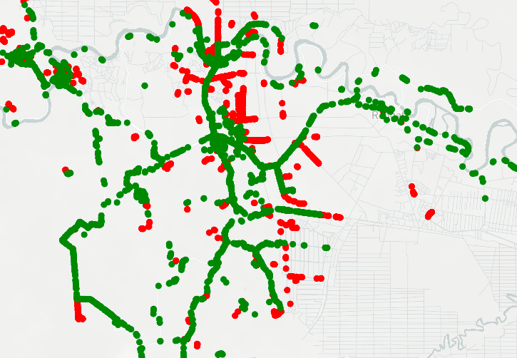

# Analyses 
In this folder, we can examine the performance of the created networks. We do this by comparing shortest paths in the initial and extended network. Note that this procedure can only be executed when an extended network exists. 

For the start and end points of the shortest paths we use the start and end points of the subtrips created using the pre-processing algorithm. Now, we start with creating a dataset that includes, for all the Origin/Destination (OD) pairs, the shortest path length in the initial and in the extended network. Moreover, we want to include other metrics that might be interesting to see. The dataset that we create looks as follows:

From | To | SP_OLD | SP_NEW | Diff | From_projected | Minimal_projection_distance_from | From_projected_distance | To_projected | Minimal_projection_distance_to | To_projected_distance | From_projected_NEW | Minimal_projection_distance_from_NEW | From_projected_distance_NEW | To_projected_NEW |	Minimal_projection_distance_to_NEW | To_projected_distance_NEW | Distance_between_from | Distance_between_to
 --- |--- |--- | --- |--- |--- |--- |--- |--- |--- |--- |---| ---| --- |--- |--- |--- |---|---
POINT(205731.6927375596 -39024.65810011271)	| POINT(204650.2855455943 -39772.95674411015)	| 1659.7	| 1659.7 | 0.0	| (205734.13828451364, -39024.15897507633)	| 2.5	| 2.5	| (204646.862610691, -39775.039426025236) |	4.0 |	4.0	| (205734.13828451364, -39024.15897507633)	| 2.5	| 2.5	| (204646.862610691, -39775.039426025236) |	4.0 |	4.0 |	0.0 |	0.0 
POINT(204665.8870010334 -39795.08210889951) |	POINT(205727.2364201575 -39022.44639382615)	| 1630.7	| 1627.7	| 3.1	| (204660.90277633906, -39798.11475629857)	| 5.8	| 5.8	| (205733.5267317863, -39021.16256976572) |	6.4	| 6.4	| (204660.90277633906, -39798.11475629857)	| 5.8	| 5.8	| (205734.13828451364, -39024.15897507633) | 6.4	| 6.4	| 0.0	| 3.1

In this dataset, `From` and `To` represent the origin and destination point (note that these are projected). Then, `SP_OLD` and `SP_NEW` are the lengths of the shortest paths between the origin and destination in the initial and extended network, respectively. `Diff` represents the difference of these lengths. Then, `From_projected` (`To_projected`) represents the projection point of the origin (destination) in the initial graph. Similarly, `From_projected_NEW` (`To_projected_NEW`) represents the projection point of the origin (destination) in the extended graph. We also include the final projection distance of the origin (destination) in the initial and extended graph. These numbers are the `From_projected_distance` (`To_projected_distance`) in the initial graph, and the `From_projected_distance_NEW` (`To_projected_distance_NEW`) in the extended graph. Note that we may not chose to project the origin (destination) on the closest edge. For instance, if a shorter path could be obtained with a different projection (while still satisfying the maximum projection distance threshold). Therefore, we also include the minimum possible distance to an edge. This is used to determine whether it is possible to project on an edge. Finally, we include the distance between the origins (destinations) in the initial and extended graphs (`Distance_between_from` and `Distance_between_to`). These numbers are used to determine whether OD pairs are similar or different. 

Now, to create such a dataset, start with specifying the settings for the analyses (use [SETTINGS_ANALYSES.py](https://github.com/valentijnstienen/PEMPEM-paper/blob/main/Analyses/SETTINGS_ANALYSES.py)). Then, execute the following commands in your command line:

```
$ python RoutingResults.py
```


After having created this new dataset, we can use it to determine some performance indicators of the new network. Also here, we can choose between different indicators. 

- **Percentage of shortest paths (SPs) that can be found**: Here, we differentiate between reasons why a shortest could not be found (e.g., due to an unprojectable origin (destination)). 
- **Plot the points that could not be projected**: This gives insight in the regions where most origins/destination could (not) be projected on the network. An example of such a plot is given below:



- 


The settings are stored in the file itself: [ResultsSP.py](https://github.com/valentijnstienen/PEMPEM-paper/blob/main/Analyses/ResultsSP.py). This means that you need to open this file and specify your wishes here. Then, execute the following commands in your command line:

```
$ python ResultsSP.py
```
