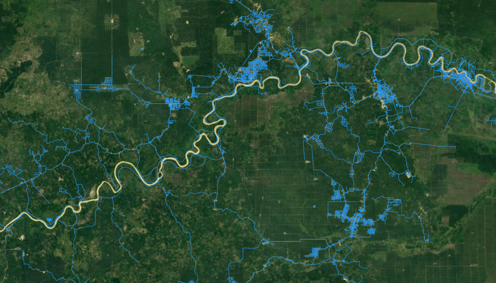
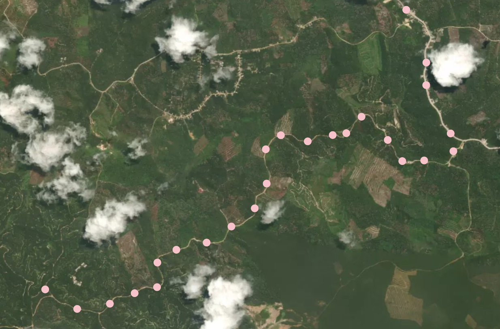

# PEMPEM-paper
Supplements to the paper "Enrich digital road networks for optimization in remote areas using GPS trajectories".

[comment]: <> (Include authors)

In this paper we discuss how to extend a given initial graph with the information in GPS trajectories. An initial graph can either be 


An example of an initial graph is shown below. 



Now, we might know that a truck has been driving a particular route that has been tracked by a GPS tracker. In other words, we might have a GPS trace that visually looks as follows: 



In this paper, we combine this information with the information that is already in the initial graph. If, for instance, this road is not present in the initial graph, we add it, otherwise, we do not (or add parts of it, if applicable). 

The GPS trajectories that are used to extend your initial graph should be saved in a CASE folder within the existing Data folder. An example of such raw GPS trajectory data is shown below:

| Date                |Latitude|Longitude|Speed  |Course |
| :------------------ |-------:|--------:|------:|------:|
| 2020-04-11 11:46:44 |-0.74603|100.53225 | 23.9 | 132  | 
| 2020-04-11 11:46:51 |-0.75559|100.54749 | 25.0 | 133 |
| 2020-04-11 11:47:51 |-0.75339|100.55469 | 37.4 | 126 |
| ... | ... | ... | ... | ... |

## Set up the environment
In order to use this tool, you need to set up the appropriate environment. The packages that are used are stored in ([requirements.txt](https://github.com/valentijnstienen/PEMPEM-paper/tree/main/requirements.txt)). If you use [conda](https://conda.io), you can clone the virtual environments by executing the following code in you command line. Make sure that you first look in the channel conda-forge before turning to the anaconda channel (otherwise conflicts may occur). 

```
$ conda create --name ENV_NAME --file requirements.txt
```


## Data pre-processing
If your raw data needs pre-processing (most likely), make sure you verify (adjust when necessary) the settings for the pre-processing algorithm ([Settings_PreprocessingAlgorithm.py](https://github.com/valentijnstienen/PEMPEM-paper/blob/main/Data%20(github)/SETTINGS_PreprocessingAlgorithm.py)) according to your wishes. For more details on the data pre-processing, we refer to the corresponding [Data pre-processing page](https://github.com/valentijnstienen/PEMPEM-paper/tree/main/Data%20(github)).


## Running the algorithm
Before running the algorithm, you need to define the settings of the algorithm ([SETTINGS.py](https://github.com/valentijnstienen/PEMPEM-paper/tree/main/SETTINGS.py)). After filling in these settings, you can run the algorithm by executing the following commands:

```
$ python mainRun.py
```

## Results
The results that are obtained and used in the paper can be visualized on [here](http://network-extension-app.herokuapp.com).
